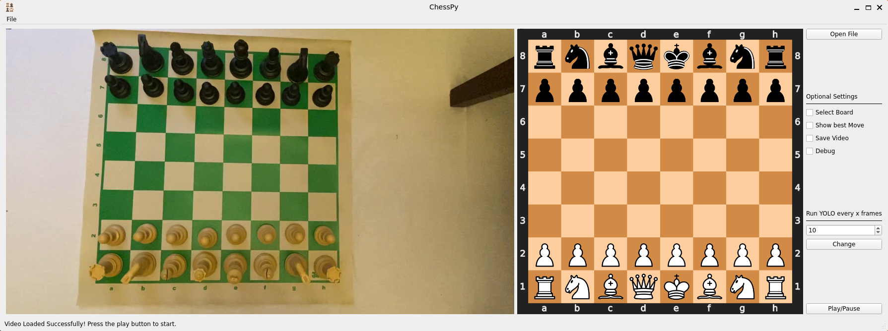

# `ChessPy: An Intelligent Chess Piece Detection Tool`

### Undergraduate Program in Computer Engineering

#### Department of Computer Engineering and Automation 


## Abstract

Chess is one of the most researched domains in the annals of artificial intelligence. The main objective of this research is to develop a platform that can determine piece positioning during chess games. Digital image processing methods and real-time object detection (YOLO version 4) algorithms were used during computational development. The problem entails analysing images captured during a chess game and determining the location of each square on the board, as well as the position of each piece in play. This procedure is repeated at each game turn, enabling the developed system to save and watch all piece moves during a game. The obtained results demonstrate the system's reliability and feasibility. 



## Texts

This study produced the following texts:

- [Portuguese] [Undergraduate Dissertation](./text/tcc_richardson.pdf) 
- [English] [Research Paper](./text/chesspy_paper.pdf)


## Datasets

The datasets used to train and test the YOLO network for chess pieces object detection are all openly available. These datasets encompass a wide range of chess piece images captured from various angles and in different lighting conditions to ensure robust training and accurate detection. By making these datasets publicly accessible, we aim to support the community in furthering research and development in computer vision applications related to chess.

|  Color |  Piece | Training Samples | Test Samples |
|:------:|:------:|:----------------:|:------------:|
|        |  Pawn  |       28789      |     7234     |
|        | Knight |       5881       |     1328     |
|        | Bishop |       4884       |     1144     |
|  White |  Rook  |       8254       |     1994     |
|        |  Queen |       3473       |      883     |
|        |  King  |       4925       |     1222     |
|        |  Pawn  |       28299      |     7000     |
|        | Knight |       4902       |     1344     |
|        | Bishop |       5541       |     1219     |
|  Black |  Rook  |       8799       |     1946     |
|        |  Queen |       3423       |      874     |
|        |  King  |       4931       |     1226     |
|  Total |        |      112101      |     27414    |

| Dataset |       Download link       |
|:-------:|:-------------------------:|
|  Train  | https://shorturl.at/upvNp |
|   Test  | https://shorturl.at/hlPZi |

You can see the image annotations using a tool like [LabelImg](https://github.com/HumanSignal/labelImg)

## YOLO Weights

The trained weights for the chess piece detection model are also freely available. By providing these pre-trained weights, we enable users to leverage our model's high accuracy and efficiency without the need for extensive computational resources or time-consuming training processes. This ensures that both researchers and enthusiasts can readily implement and benefit from advanced chess piece detection capabilities.

|  Network  |                         Configuration                         |                                Weights                                |
|:---------:|:-------------------------------------------------------------:|:---------------------------------------------------------------------:|
| YOLO Full |      [yolov4_chess.cfg](./yolo/configs/yolov4_chess.cfg)      |      [yolov4_chess.weights](./yolo/weights/yolov4_chess.weights)      |
| YOLO Tiny | [yolov4_tiny_chess.cfg](./yolo/configs/yolov4_tiny_chess.cfg) | [yolov4_tiny_chess.weights](./yolo/weights/yolov4_tiny_chess.weights) |

It's also important to edit the metadata file with the correct path to the file containing the name of each class in the correct order. For that update the path to the [chess_obj.names](./yolo/data/chess_obj.names) in the metadata file [chess_obj.data](./yolo/data/chess_obj.data):

```
> chess_obj.data
classes=12
train=data/train.txt
valid=data/test.txt
names=<PATH TO THE `chess_obj.names` FILE>
backup=backup/
```

The training logs files can be seen at the [logs dir](./logs/) 


## Installation

> [!WARNING]
> The code was validated on Ubuntu and on Windows using WSL. The console commands assume you're using a Linux system!

To run the provided code, the first step is to clone this repository, which can be accomplished by:

```console
user@computer:~$ git clone https://github.com/xarmison/chesspy
```

### Compiling the YOLO network

The YOLOv4 network used in the implementations is based on [Alexey's C implementation](https://github.com/AlexeyAB), complemented by a custom Python interface designed to interact with the compiled library. To utilize this setup, it is essential to compile the code on your machine. This can be achieved by executing the following steps.

First, edit the compilation configuration that reflects the hardware you've got available. The default configuration assumes you're compiling on a system with a GPU and the CUDNN library, adapt the [Makefile](./yolo_repo/Makefile) as necessary.

```
> Makefile
GPU=1
CUDNN=1
CUDNN_HALF=0
OPENCV=0
AVX=0
OPENMP=0
LIBSO=1
ZED_CAMERA=0
ZED_CAMERA_v2_8=0
```

Then compile the code.

```console
user@computer:~/chesspy $ cd yolo_repo
user@computer:~/chesspy/yolo_repo $ make -j8
```

You also need to create a variable with the path to this build directory.

```console
user@computer:~/chesspy/yolo_repo $ export YOLO_PATH=<path to the yolo_repo directory>
```

### Python environment

This section is a guide to the installations of a python environment with the requirements of this repository.

First, install [Anaconda](https://www.anaconda.com/distribution/) or [Miniconda](https://docs.conda.io/en/latest/miniconda.html), both of them give you the "conda" command line tool , but the latter requires less disk space.

Now, create a python virtual environment and install the required packages following the commands. Substitute **<environment_name>** with a name for your environment

Open your terminal and execute the following commands:

```console
user@computer:~/chesspy $ conda create -n <enviroment_name> anaconda python=3
user@computer:~/chesspy $ conda activate <enviroment_name> || source activate <enviroment_name>
(<enviroment_name>) user@computer:~/chesspy $ conda install --yes --file requirements.txt
```

## Available Tools

The results of this study have yielded a suite of powerful tools designed to facilitate chess piece object detection using the YOLOv4 network.

### Chess Pieces Detection on a Static Image

The [Chess Pieces Detection on a Static Image tool](./scripts/board_detection.py) leverages the power of the YOLOv4 network to accurately identify and locate chess pieces within a still image. By simply inputting an image, users can quickly and efficiently determine the positions and identities of all chess pieces present, facilitating various applications from game analysis to educational purposes.

```console
(<enviroment_name>) user@computer:~/chesspy/scripts $ python 
```


### Chess Pieces Detection on a Video Stream

The [Chess Pieces Detection on a Video Stream tool](./scripts/board_detection_video.py) offers real-time identification and tracking of chess pieces during live gameplay. By processing each frame of the video feed, this tool accurately detects and monitors the positions and movements of the pieces, providing continuous updates throughout the game. Ideal for both casual players and professional analysts, this tool enhances the experience by enabling dynamic analysis and insights during matches.

```console
(<enviroment_name>) user@computer:~/chesspy/scripts $ python board_detection_video.py ../assets/ex_game.mp4 --config-path ../yolo/configs/yolov4_tiny_chess.cfg --weights-path ../yolo/weights/yolov4_tiny_chess.weights --meta-path ../yolo/data/chess_obj.data --show-best-move --debug 
```


### Graphical User Interface 

The [Graphical User Interface (GUI)](./gui/main.py) tool simplifies the use of our chess piece detection capabilities by encapsulating the video stream detection script in an intuitive, user-friendly interface. This GUI allows users to effortlessly monitor and analyze chess piece movements in real-time, without needing to interact directly with the underlying code.

```console
(<enviroment_name>) user@computer:~/chesspy/gui $ python main.py 
```


